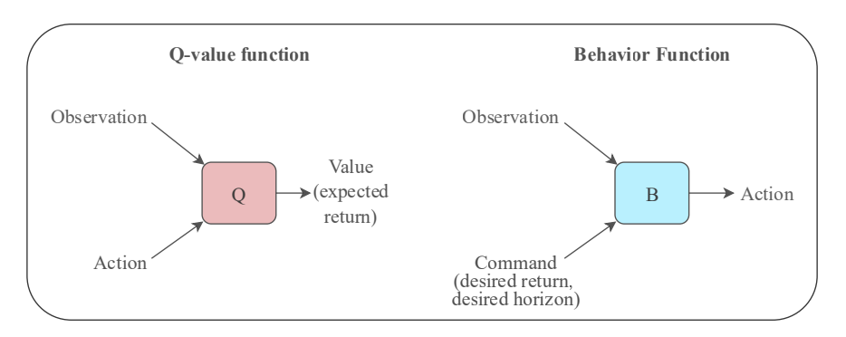
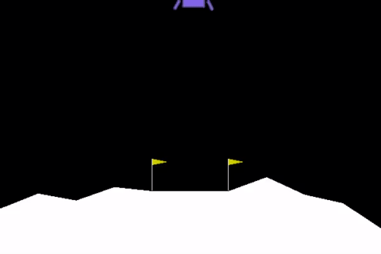
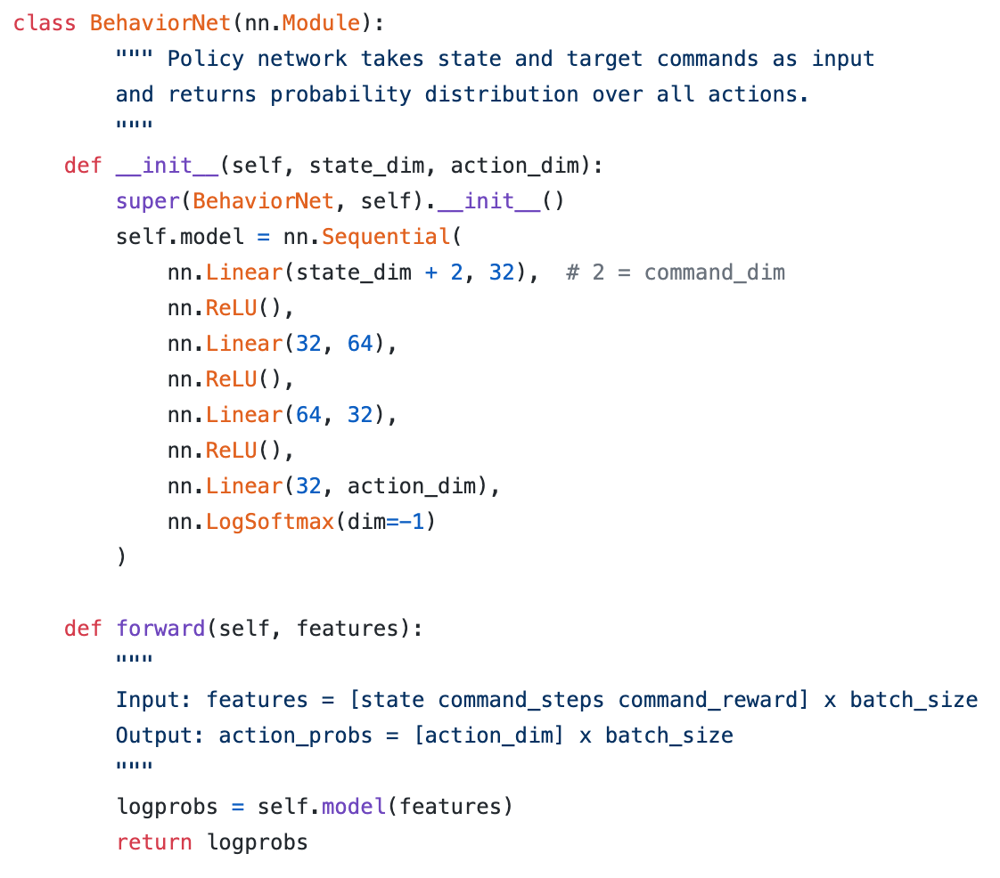
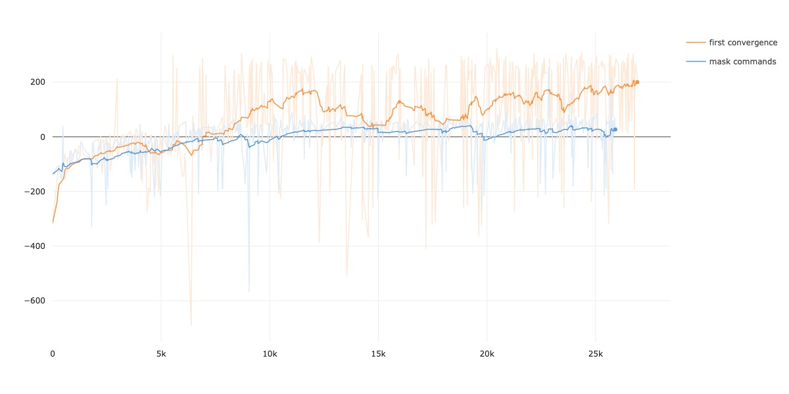

# Is Upside-Down Reinforcement Learning = Imitation Learning?

<a href="https://arxiv.org/abs/1912.02877">Paper</a>
•  
<a href="https://github.com/bprabhakar/upside-down-reinforcement-learning">Github Repo</a>

## What is Upside-Down Reinforcement Learning?

I found out about this work while attending an RL workshop at NeurIPS 2019. Honestly, it was one of the coolest ideas I stumbled upon at the conference. You can take a look at my other favourite ideas from the conference [here](https://bprabhakar.github.io/2020/02/05/neurips.html). Anyway, this post is about inspecting upside-down reinforcement learning more. Here's what the abstract says:

> *Traditional Reinforcement Learning (RL) algorithms either predict rewards with value functions or maximize them using policy search. We study an alternative: Upside-Down Reinforcement Learning (Upside-Down RL or UDRL), that solves RL problems primarily using supervised learning techniques. Here we present the first concrete implementation of UDRL and demonstrate its feasibility on certain episodic learning problems. Experimental results show that its performance can be surprisingly competitive with, and even exceed that of traditional baseline algorithms developed over decades of research.*

If you want to deep dive into the paper and understand it more, you can watch this excellent [video](https://www.youtube.com/watch?v=RrvC8YW0pT0). But tl;dr - they've devised a new supervised learning algorithm to solve reinforcement learning tasks. No policy gradients, no value function estimations, just plain old supervised learning. Here's a figure from the paper to illustrate this better:

What the behavior function is trying to predict is — *given this observation, what is the best action to take to achieve this desired return (total reward) in this desired horizon (total timesteps)*. Instead of learning/modeling rewards they're used as inputs (commands) to directly predict actions. 

To understand the overall algorithm better, I ran a few quick experiments. This post documents my findings.

In particular, I wanted to answer the following two questions:

1. Since implementing most RL algorithms is extremely non-trivial, how easy is to get this algorithm up and running?

2. Is it just a cleverly disguised Imitation Learning algorithm?

## Task to solve — *Sparse Lunar Lander*

To answer the above questions, I implemented the algorithm to solve the Sparse Lunar Lander task (one of the tasks mentioned in the paper). The task is to learn an agent that is able to successfully land a lunar lover as shown below:

I manually converted the "LunarLander-v2" environment from OpenAI Gym to a sparse one by modifying the reward function as follows:

- 0 reward for all non-terminal steps
- total episode reward for the final terminal step

## Implementation notes

- All the learning components were implemented using Pytorch
- The paper lists down all the hyper-parameter values they swept for their experiments. I did not tune them at all; just picked the middle values for each one.
- Model architecture:

    

- Used [comet.ml](http://comet.ml/) for metric tracking

Code for this experiment can be accessed [here](https://github.com/bprabhakar/upside-down-reinforcement-learning).

Now, over to the experiment findings.

## How easy is it to make the algorithm work?

Answer - surprisingly quick. I was able to get the following reward curve in just my **third**(!) run attempt; without needing to tinker around a lot with the hyper-parameters. I don't remember the last time that happened for any of the policy gradient based algorithms.

Of course, this needs to be taken with a grain of salt because "Lunar Lander" is a relatively simple task. But if you look at the implemented algorithm in code, you'll agree that the algorithm is ridiculously simple!

## Is it just Imitation Learning in disguise?

My first impression on reading the paper was that the idea sounds very similar to Imitation Learning. Consider the following excerpt from the paper describing the replay buffer strategy:

So as training progresses, by design the trajectories stored in the buffer start looking more and more like *expert trajectories* (episodes with high returns). And learning just a mapping from states to actions on these expert trajectories (re: Imitation Learning) should suffice. This idea is actually better expressed in this prior work called — [Self-Imitation Learning](https://arxiv.org/abs/1806.05635).

To test this hypothesis, I ran the following experiment — trying to learn the optimal actions to take by **masking out the command inputs** of the behavior function (keeping everything else identical). So effectively, just learning to predict actions from just the observations alone. And here's what happened:

Clearly, having *commands* as inputs to the behavior function make a difference. My guess is that having these commands help the agent further distinguish different types of high return trajectories, in turn helping it learn faster. This obviously needs to be further tested on more complex environments, but the results from my micro-experiment are definitely encouraging.
